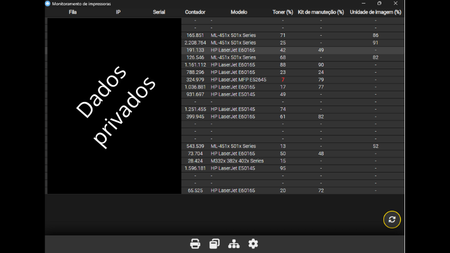

### Monitoramento de impressoras

O projeto visa atender o monitoramento dos suprimentos de impressoras HP,Samsung e Zebra dentro de um rede, 
faz as requisições por snmp para busca das informações e exibe o relatório em tela facilitando o acompanhamento  
para solicitação de novos suprimentos.

 
 

 
 

Foi criado em Javascript, HTML e CSS com o framework electronJS e o Handlebars como template engine. 
A execução é local, ficando minimizado na barra de tarefas. 
A inserção das impressoras exige um hostname e IP, pode ser feita manualmente uma a uma ou por um arquivo CSV. 

O download do instalador pode ser realizado em: https://drive.google.com/file/d/1YkauOYiHCjwvCOBlN1dnjkgqx9-8xoeu/view?usp=sharing
